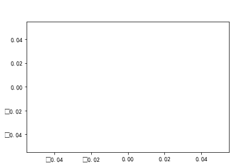

# Matplotlib数据可视化


```python
import matplotlib.pyplot as plt # 导入pyplot子库
```

## 01 Matplotlib 绘图基础
### (1) Figure 对象


```python
plt.figure(figsize = (3, 2), facecolor = 'green')
plt.plot()
plt.show()
```


### (2) 划分子图


```python
plt.subplot(2, 2, 1) # 参数含义：2行，2列，第1个子图
plt.subplot(2, 2, 2) # 参数含义：2行，2列，第2个子图
plt.subplot(2, 2, 3) # 参数含义：2行，2列，第3个子图
plt.subplot(2, 2, 4) # 参数含义：2行，2列，第4个子图

plt.show()
```


### (3) 设置中文字体


### (4) 添加标题


```python
plt.rcParams['font.sans-serif'] = 'SimHei'
plt.suptitle('全局标题', color = 'white', fontsize = 20)
plt.plot()
plt.show()
```





```python
plt.rcParams['font.sans-serif'] = 'SimHei'
plt.suptitle('全局标题', color = 'white', fontsize = 16, y = 1.0)
plt.subplot(2, 1, 1) # 参数含义：2行，1列，第1个子图
plt.title('第一个图', color = 'white') # 添加第一个图的标题
plt.subplot(2, 1, 2) # 参数含义：2行，1列，第2个子图
plt.title('第二个图', color = 'white') # 添加第二个图的标题
plt.show()
```


### (5) tight_layout()函数


```python

```
