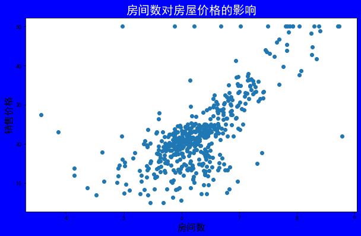
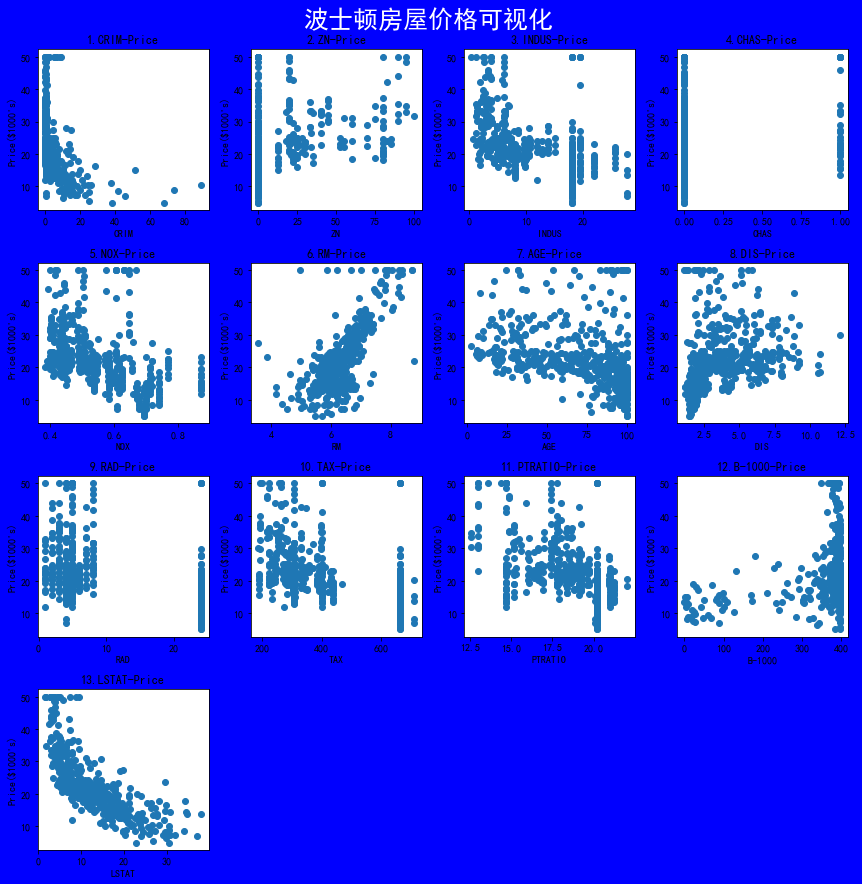

# Matplotlib 波士顿房价数据可视化


```python
import tensorflow as tf
```

## 01 波士顿房价数据集的内容及获取方式


```python
bostion_housing = tf.keras.datasets.boston_housing # 获取数据集
(train_x, train_y), (test_x, test_y) = bostion_housing.load_data(test_split = 0) # 加载数据集
```


```python
print("Training set: ", len(train_x)) # 训练数据集中数据个数
print("Testing set: ", len(test_x)) # 测试数据集中数据个数
```

    Training set:  506
    Testing set:  0
    


```python
print(train_x[:, 5][1: 20]) # 获取数据集中房间数的前20条数据
```

    [7.61  4.97  6.037 6.376 5.708 5.536 5.468 5.628 5.019 6.404 4.628 5.572
     6.251 5.613 5.957 7.016 6.345 6.162 6.727]
    

## 02 数据可视化


```python
import matplotlib.pyplot as plt
```

### (1) 单独一种因素的绘图


```python
plt.rcParams['font.sans-serif'] = 'SimHei'
plt.figure(figsize=(10, 6), facecolor='blue')
plt.scatter(train_x[:, 5], train_y)
plt.xlabel('房间数', fontsize = 16)
plt.ylabel('销售价格', fontsize = 16)
plt.title('房间数对房屋价格的影响', color = 'white', fontsize = 20)
plt.show()
```





### (2) 所有因素的绘图


```python
title = ['CRIM', 'ZN', 'INDUS', 'CHAS', 'NOX', 'RM', 'AGE', 'DIS',
        'RAD', 'TAX', 'PTRATIO', 'B-1000', 'LSTAT', 'MEDV']
plt.figure(figsize=(12, 12), facecolor='blue')
plt.suptitle('波士顿房屋价格可视化', color = 'white', x=0.5, y=1.02, fontsize = 25)
for i in range(13):
    plt.subplot(4, 4, (i+1))
    plt.scatter(train_x[:, i], train_y)
    plt.xlabel(title[i])
    plt.ylabel("Price($1000's)")
    plt.title(str(i+1) + '.' + title[i] + '-Price')
    
plt.tight_layout()
plt.show()
```





```python

```
